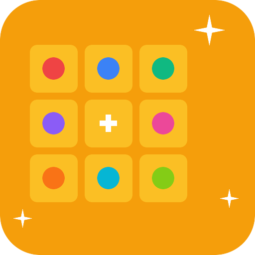

<p align="center">
  
</p>

<h1 align="center">Book a Huddle</h1>

<p align="center">
  <strong>Schedule Slack Huddles with your team.</strong><br/>
  Pick a time, a channel, and your participants &mdash; everyone gets notified when it's go time.
</p>

<p align="center">
  <a href="#install">Install</a>&ensp;&middot;&ensp;
  <a href="#usage">Usage</a>&ensp;&middot;&ensp;
  <a href="#architecture">Architecture</a>&ensp;&middot;&ensp;
  <a href="#development">Development</a>&ensp;&middot;&ensp;
  <a href="#license">License</a>
</p>

---

## Why this exists

Slack Huddles are fast, frictionless audio calls that live inside channels. They've become the default way many teams meet &mdash; but Slack provides **no way to schedule one in advance**. There is no Huddle API, no calendar integration, no booking flow.

Book a Huddle fills that gap. It runs entirely on the [Slack Platform](https://api.slack.com/automation) (Deno runtime, hosted by Slack) so there is nothing to deploy or maintain outside your workspace.

> **Note** &mdash; Because Slack exposes no API for starting a Huddle programmatically, the app posts a rich notification at the scheduled time that @mentions every participant and tells them to click the headphones icon. That single manual click is the only step that can't be automated.

## How it works

```
1. Click the "Boka en huddle" shortcut
2. Fill in the form  ─  title, channel, participants, date & time
3. A confirmation card is posted to the channel
4. At the scheduled time, a notification @mentions everyone
5. Participants click 🎧 in the channel header to join
```

## Screenshots

<!-- Replace with actual screenshots after deploying -->

| Booking form | Confirmation | Notification |
|:---:|:---:|:---:|
| *screenshot* | *screenshot* | *screenshot* |

---

<h2 id="install">Install</h2>

### Prerequisites

| Requirement | |
|---|---|
| [Slack CLI](https://api.slack.com/automation/cli/install) | `slack --version` &ge; 2.9 |
| [Deno](https://deno.land) | `deno --version` &ge; 1.37 |
| A **paid Slack workspace** | The Slack Platform requires Pro, Business+, or Enterprise Grid |

### Clone & deploy

```bash
git clone https://github.com/YOUR_USER/book-a-huddle.git
cd book-a-huddle

# Deploy to your workspace
slack deploy
```

### Create the triggers

After deploying, create the four link triggers:

```bash
slack trigger create --trigger-def triggers/book_huddle_trigger.ts
slack trigger create --trigger-def triggers/list_huddles_trigger.ts
slack trigger create --trigger-def triggers/cancel_huddle_trigger.ts
slack trigger create --trigger-def triggers/edit_huddle_trigger.ts
```

Each command returns a shortcut URL (e.g. `https://slack.com/shortcuts/Ft.../...`). Bookmark them, pin them to a channel, or add them to a canvas for easy access.

### Invite the bot

In every channel where you want to use the app:

```
/invite @Book a Huddle
```

---

<h2 id="usage">Usage</h2>

The app provides four shortcuts. Everything defaults to **English**; bot messages are localized based on the user's Slack locale (English and Swedish supported).

### Book a huddle

Opens a form where you pick:

| Field | Description |
|---|---|
| **Title** | A short name &mdash; *Sprint planning*, *Standup*, *Brainstorm* |
| **Channel** | The channel where the Huddle will happen |
| **Participants** | One or more teammates |
| **Date** | A date picker |
| **Time** | A dropdown with 30-minute slots from 08:00 to 17:30 |
| **Recurrence** | One-time, daily, or weekly recurrence |
| **DM reminder** | Optional DM reminder 5&ndash;30 minutes before (off by default) |

On submit, the app posts a confirmation card to the channel and creates scheduled trigger(s) behind the scenes. Recurring bookings use daily or weekly triggers that fire until cancelled.

### List bookings

Lists all upcoming huddle bookings for a channel, sorted by date. Each entry shows the title, time, participants, recurrence type, DM reminder setting, creator, and booking ID.

### Edit huddle

Opens a modal pre-filled with the current booking details. Change the title, participants, date, time, recurrence, or DM reminder settings. The old trigger(s) are deleted and new ones created.

### Cancel huddle

Cancels a booking by ID. Only the person who created the booking can cancel it. All scheduled triggers (notification + DM reminder) are deleted and a cancellation notice is posted to the channel.

---

<h2 id="architecture">Architecture</h2>

```
book-a-huddle/
├── manifest.ts                 ← App manifest (workflows, datastores, scopes)
├── i18n/
│   ├── mod.ts                  ← t() translation + detectLocale()
│   ├── sv.ts                   ← Swedish strings (default)
│   └── en.ts                   ← English strings
├── datastores/
│   └── huddle_bookings.ts      ← Booking records
├── functions/
│   ├── save_booking.ts         ← Validate → create trigger(s) → save → confirm
│   ├── send_huddle_notification.ts  ← Post notification → mark completed (one-time only)
│   ├── send_dm_reminders.ts    ← DM each participant before huddle
│   ├── list_bookings.ts        ← Query → filter → format → post
│   ├── cancel_booking.ts       ← Verify ownership → delete trigger(s) → mark cancelled
│   └── edit_booking.ts         ← Modal via views.open → update trigger(s) + datastore
├── workflows/
│   ├── book_huddle.ts          ← OpenForm → save_booking
│   ├── notify_huddle.ts        ← send_huddle_notification (fired by dynamic trigger)
│   ├── dm_reminder.ts          ← send_dm_reminders (fired by DM trigger)
│   ├── edit_huddle.ts          ← OpenForm (booking ID) → edit_booking (modal)
│   ├── list_huddles.ts         ← OpenForm (channel picker) → list_bookings
│   └── cancel_huddle.ts        ← OpenForm (booking ID) → cancel_booking
└── triggers/
    ├── book_huddle_trigger.ts  ← Link trigger (shortcut)
    ├── edit_huddle_trigger.ts
    ├── list_huddles_trigger.ts
    └── cancel_huddle_trigger.ts
```

### Key design decisions

**Dynamic scheduled triggers** &mdash; Each booking creates one or two triggers at runtime via `client.workflows.triggers.create()`. One-time bookings use `frequency: "once"` (auto-cleaned by Slack after firing). Recurring bookings use `"daily"` or `"weekly"` frequency with a 1-year end time.

**DM reminder triggers** &mdash; When enabled, a second trigger fires N minutes before the huddle and sends a DM to each participant. Uses the same recurrence frequency as the main trigger.

**Transactional ordering** &mdash; Triggers are created *before* saving to the datastore. If the datastore write fails, all orphan triggers are cleaned up.

**Graceful degradation** &mdash; If a booking is cancelled but a trigger delete fails, the notification function checks the booking status and silently no-ops.

**Localization** &mdash; Bot messages are localized based on the user's Slack locale (detected via `users.info`). English is the default; Swedish is also supported. Additional languages can be added by creating a new locale file in `i18n/`.

### Datastore schema

| Column | Type | |
|---|---|---|
| `id` | `string` | UUID, primary key |
| `title` | `string` | Human-readable name |
| `channel_id` | `channel_id` | Target channel |
| `creator_id` | `user_id` | Who created the booking |
| `participants_json` | `string` | JSON array of user IDs |
| `scheduled_date` | `string` | `YYYY-MM-DD` |
| `scheduled_time` | `string` | `HH:MM` |
| `trigger_id` | `string` | Main notification trigger |
| `status` | `string` | `active` / `cancelled` / `completed` |
| `created_at` | `string` | ISO 8601 |
| `recurrence_type` | `string` | `once` / `daily` / `weekly` |
| `dm_reminder_minutes` | `string` | `0` / `5` / `10` / `15` / `30` |
| `dm_trigger_id` | `string` | DM reminder trigger (empty if disabled) |
| `creator_locale` | `string` | `sv` / `en` (for async notifications) |

### Bot scopes

```
commands  chat:write  chat:write.public
datastore:read  datastore:write
triggers:write  triggers:read  users:read
```

---

<h2 id="development">Development</h2>

### Local development

```bash
slack run
```

This starts the app in development mode with hot-reloading. Create triggers against the local app the same way as production.

### Tests

```bash
deno task test
```

Runs formatting checks, linting, and the full test suite. Tests use the same fetch-stubbing pattern as the Slack SDK samples &mdash; no network calls, no Slack workspace required.

**49 tests** across six test files covering:

- Happy paths for booking, notification, listing, cancellation, editing, and DM reminders
- Recurring trigger creation (daily, weekly with derived weekday)
- DM reminder trigger creation and cleanup
- Past-date validation
- Trigger creation / deletion failures (including multi-trigger cleanup)
- Datastore read / write failures
- Chat post failures
- Authorization checks (only creator can cancel/edit)
- Graceful handling of missing or already-cancelled bookings
- Modal opening with pre-filled values (edit flow)
- Message formatting and Block Kit structure
- Singular / plural Swedish grammar
- Localization (Swedish default, English detection)

### Code quality

```bash
deno fmt --check    # Formatting
deno lint           # Linting
```

Both are included in `deno task test` and enforced before tests run.

---

## Contributing

Contributions are welcome. Please open an issue to discuss larger changes before submitting a PR.

```bash
# Fork & clone
git clone https://github.com/YOUR_USER/book-a-huddle.git
cd book-a-huddle

# Run tests before submitting
deno task test
```

### Ideas for future work

- More recurrence options (bi-weekly, monthly, custom day selection)
- Thread replies on the notification message for discussion
- Integration with Google Calendar / Outlook
- Additional language support beyond Swedish and English

---

<h2 id="license">License</h2>

[MIT](LICENSE) &copy; Gunnar R Johansson
